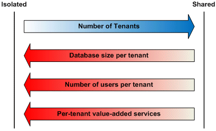

# Multitenancy \(Multi-inquilino\)

O termo multitenancy ou multi-inquilino em português, em geral, é aplicado ao desenvolvimento de software para indicar uma arquitetura em que uma única instância de um aplicativo serve simultaneamente vários clientes \(inquilinos\).

Isto é muito comum em soluções SaaS. Isolando informações \(dados, personalizações, etc.\) referentes aos vários inquilinos é um desafio especial nestes sistemas. Isto inclui os dados de propriedade de cada inquilino armazenados no banco de dados.

O Framework Demoiselle fornece alguns facilitadores e a documentação necessária para que uma aplicação com as características de Multitenancy seja desenvolvida.

## Estratégias para Disponibilização dos Serviços

Existem pelo menos 3 estratégias para a camada de serviço, que no caso do Framework Demoiselle versão 3 trata basicamente serviços REST. As 3 principais abordagens são:

1. Utilização de **Subdomínio \(DNS\)** - nesta utilização cada inquilino se utiliza de um subdomínio próprio fornecido pelo servidor de DNS como por exemplo _cliente01.meudominio.com_ e _cliente02.meudominio.com_.
2. Utilização de **Metadados** - a utilização de meta dados basicamente utiliza algum dado do usuário para o direcionar para o inquilino correto, normalmente o direcionamento somente pode ser feito após a identificação do usuário que comumente é feito por meio de acesso ao sistema utilizando um e-mail e senha
3. Utilização de **URL** - nesta abordagem quem determinará o inquilino que será usado é a URL acessada, por exemplo _meudominio.com/cliente01/api/servico_ e _meudominio.com/cliente02/api/servico_

Abaixo estão as principais **desvantagens** de cada uma das 3 abordagens:

1. A principal desvantagem no caso de subdomínios é a necessidade de uma maior integração entre a aplicação e os serviços de rede da solução, pois a criação de novos nomes no serviço de DNS necessita de alguma integração
2. A desvantagem do Metadado é que exige alguma forma de identificação prévia do usuário, dificultando a criação de serviços públicos
3. Na utilização de URL em todas as requisições é necessário que seja feita a verificação da existência de um inquilino e será uma URL diferente para cada inquilino

## Estratégias de Armazenamento de Dados

Assim como na disponibilização dos serviços o armazenamento dos dados possui pelo menos 3 estratégias de implementação de multitenancy, seguem elas:

1. **Instâncias de banco de dados separadas** - Cada inquilino tem seus dados mantidos em instâncias de banco de dados fisicamente separadas.
2. **Schemas diferentes dentro de uma mesma instância** - Cada inquilino tem seus dados mantidos em um _Schema_ separado, mas em uma única instância física.
3. **Mesma instância e schema para todos utilizando um discriminador** - Todos os dados são matidos em um único _Schema_ dentro de uma única instância física de banco de dados e a separação dos dados de cada inquilino é feita por meio de discriminadores, normalmente se utiliza uma chave estrageira nas tabelas para identificar o inquilino.

A escolha da estratégia do armazenamento é uma decisão de projeto e existem diversos fatores que devem ser levados em consideração e são mais detalhados no artigo do link [https://msdn.microsoft.com/en-us/library/aa479086.aspx](https://msdn.microsoft.com/en-us/library/aa479086.aspx). Com relação a especificamente a Multitenancy no Hibernate \(Implementação que iremos usar\) é recomendada a leitura do artigo [https://docs.jboss.org/hibernate/orm/5.2/userguide/html\_single/Hibernate\_User\_Guide.html\#multitenacy](https://docs.jboss.org/hibernate/orm/5.2/userguide/html_single/Hibernate_User_Guide.html#multitenacy).

Um dos principais pontos que deve ser levado em consideração na escolha da estratégia de armazenamento é a questão do isolamento das informações que tem impacto direto em diversos requisitos funcionais e não funcionais como Performance e Segurança.

Abaixo um gráfico que exemplifica a questão do isolamento e as possíveis estratégias usadas.

A principal ideia é de que quando mais isolado e independente os dados forem, e portanto possibilitando um maior controle, mais recomendada é a estratégia de Instâncias de banco de dados separadas. Por outro lado se existem requisitos que permitam compartilhamento de dados e um Schema único o ideal é a utilização da estratégia de um único Schema em uma única instância de banco de dados e por fim a estratégia que fica entre as 2 soluções que permite um isolamento por Schema mas que não compatilha dados entre inquilinos.

Alguns pontos a serem levados em considerações são representados no gráfico baixo.

## Multitenancy no Framework Demoiselle

É importante que antes iniciar o desenvolvimento da solução que usará o multitenancy sejam definidas as estratégias em cada camada com base nos requisitos, pois como já foi comentado cada solução é única e deve ser analisada individualmente.

Nos próximos capítulos deste documento serão dadas as instruções para utilização do projeto de Multitenancy do Framework Demoiselle que pode ser encontrado no endereço https://github.com/demoiselle/tenant.

