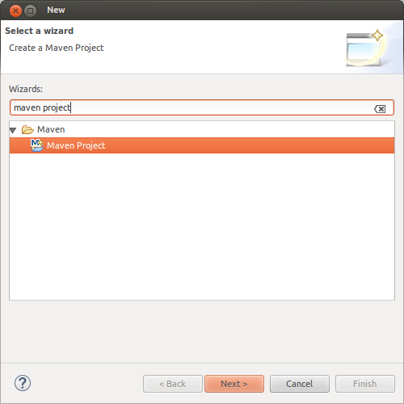
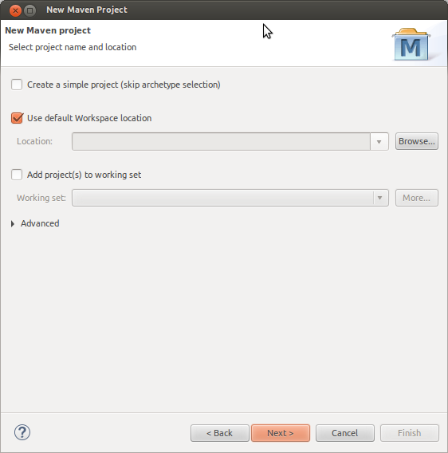
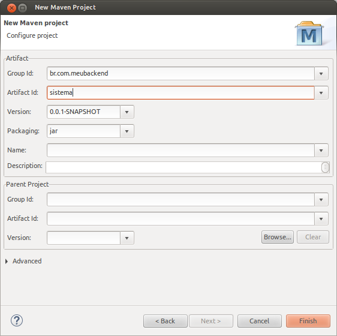
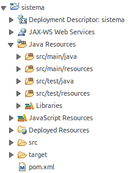
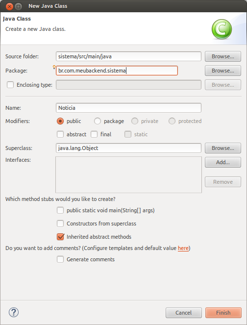

# Roteiro Rápido de Construção do Back-end
O objetivo deste roteiro é iniciar um novo aplicativo utilizando o Framework Demoiselle 3.

No começo será criada a aplicação que irá rodar no servidor, comumente conhecida como back-end.
## Pré Requisitos de Uso
* Eclipse Neon
  * [32 bits](http://www.eclipse.org/downloads/download.php?file=/technology/epp/downloads/release/neon/1/eclipse-jee-neon-1-linux-gtk.tar.gz) / [64 bits](http://www.eclipse.org/downloads/download.php?file=/technology/epp/downloads/release/neon/1/eclipse-jee-neon-1-linux-gtk-x86_64.tar.gz)
* JDK 1.8
  * [Download no site da Oracle](http://www.oracle.com/technetwork/pt/java/javase/downloads/jdk8-downloads-2133151.html)
* WildFly 10.1.0.Final
  * [Download no site do WildFly](http://wildfly.org/downloads/)

## Criação do Projeto REST
Com o Eclipse aberto acesse o menu **File > New > Other**, na janela seguinte filtre por "maven project" como mostra a imagem abaixo:



Clique no botão **Next**, e na próxima tela selecione a opção "Create a simple project (skip archetype selection)" como mostra a imagem abaixo. Esta opção seleciona a criação de um projeto simples sem escolha de arquétipo Maven.



Clique no botão **Next** e na próxima tela digite "br.com.meubackend" no **Group Id** e "sistema" no **Artifact Id**, sem as aspas e por fim escolha "war" no campo **Packaging** como mostra a imagem abaixo.



Clique no botão **Finish**.

### Erro do Web.xml
Neste ponto da criação seu projeto deve estar com o seguinte erro:
```
web.xml is missing and <failOnMissingWebXml> is set to true
```
Para corrigir o problema clique sobre item "Deployment Description: sistema" do projeto e em seguida **Generate Deployment Descriptor Stub**.

### Parent POM - Demoiselle REST
Para carregar todos os módulso padrões para REST e as configurações necessárias para a instalação em um container JEE 7 basta adicionar o seguinte trecho de código em seu `pom.xml`.
```xml
<parent>
    <groupId>org.demoiselle.jee</groupId>
    <artifactId>demoiselle-parent-rest</artifactId>
    <version>3.0.0-BETA1</version>
</parent>
```

> Após adicionar é importante atualizar as configurações do Maven clicando sobre o projeto com o botão direito do mouse, acessando as opções do Maven e por fim clicando em **Update Project**. Na tela que será aberta selecione o seu projeto e clique em **OK**.

O resultado da criação deve ser algo parecido com a imagem abaixo.



O `pom.xml` deve parecer com o seguinte:

```xml
<project xmlns="http://maven.apache.org/POM/4.0.0" xmlns:xsi="http://www.w3.org/2001/XMLSchema-instance"
	xsi:schemaLocation="http://maven.apache.org/POM/4.0.0 http://maven.apache.org/xsd/maven-4.0.0.xsd">
	<modelVersion>4.0.0</modelVersion>
	<groupId>br.com.meubackendsistema</groupId>
	<artifactId>sistema</artifactId>
	<version>0.0.1-SNAPSHOT</version>
	<packaging>war</packaging>

	<parent>
		<groupId>org.demoiselle.jee</groupId>
		<artifactId>demoiselle-parent-rest</artifactId>
		<version>3.0.0-BETA1</version>
	</parent>
</project>
```

Ao adicionar o **Parent POM REST** do Demoiselle os seguinte módulos serão carregados:
* **Core** - demoiselle-core
* **Security - JWT** - demoiselle-security-jwt
* **Persistence JPA** - demoiselle-persistence-jpa

## Criação das Entidades e Persistência
Vamos começar criando a classe Notícia com as seguintes informações.



A classe da Notícia deverá se parecer com o seguinte após adicionarmos as anotações de persistência:

```java
package br.com.meubackend.sistema.entity;

import javax.persistence.Column;
import javax.persistence.Entity;
import javax.persistence.GeneratedValue;
import javax.persistence.GenerationType;
import javax.persistence.Id;

@Entity
public class Noticia {

	@Id
	@GeneratedValue(strategy = GenerationType.IDENTITY)
	@Column(nullable = false)
	private Integer id;

	@Column(nullable = false)
	private String titulo;

	@Column(nullable = true)
	private String descricao;

	public Noticia() {
		
	}
    
    // Getters and Setters
}
```

A classe Notícia descrever por meio da anotação **@Entity** que é uma entidade que pode ser persistida e por padrão será criada uma tabela chamada noticia no banco de dados.

> Para facilitar o roteiro utilizaremos um banco de dados em memória que já vem embutido com o WildFly.

Para a configuração da persistência do projeto criaremos dentro da estrutura de pasta `src/main/resources/META-INF/` o arquivo `persistence.xml` com o seguinte conteúdo.

```xml
<?xml version="1.0" encoding="UTF-8"?>
<persistence version="2.1"
	xmlns="http://xmlns.jcp.org/xml/ns/persistence" xmlns:xsi="http://www.w3.org/2001/XMLSchema-instance"
	xsi:schemaLocation="http://xmlns.jcp.org/xml/ns/persistence http://xmlns.jcp.org/xml/ns/persistence/persistence_2_1.xsd">
	<persistence-unit name="ExamplePU" transaction-type="JTA">
		<provider>org.hibernate.ejb.HibernatePersistence</provider>
		<jta-data-source>java:jboss/datasources/ExampleDS</jta-data-source>
		<class>br.com.meubackend.sistema.entity.Noticia</class>
		<exclude-unlisted-classes>false</exclude-unlisted-classes>
		<properties>
			<property name="hibernate.dialect" value="org.hibernate.dialect.HSQLDialect" />
			<property name="hibernate.hbm2ddl.auto" value="create-drop" />
		</properties>
	</persistence-unit>	
</persistence>
```

## Criação dos Serviços REST
Texto.
## Testando o Back-end da Aplicação
SWAGGER!!!