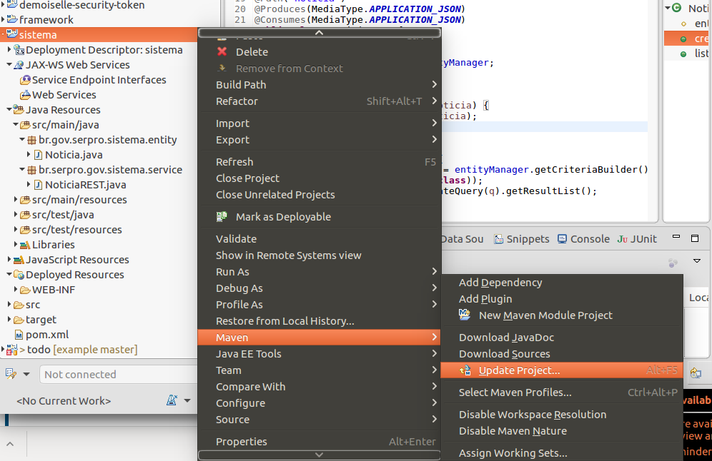
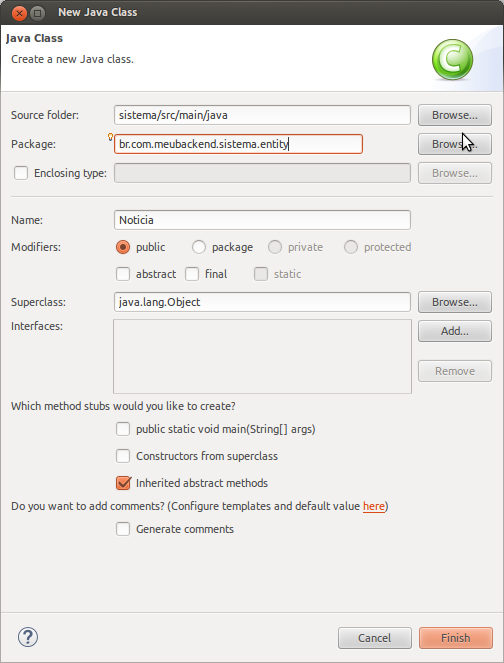
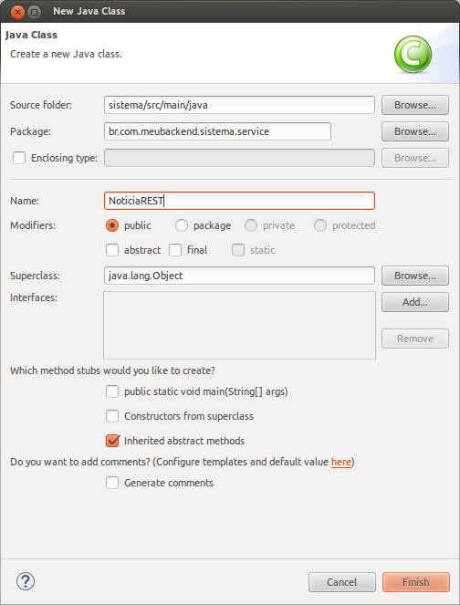

# Roteiro Rápido de Construção do Back-end

O objetivo deste roteiro é iniciar um novo aplicativo utilizando o Framework Demoiselle 3.

A aplicação criada irá rodar no servidor, comumente conhecida como back-end.

## Pré Requisitos de Uso

* Eclipse Neon
  * [32 bits](http://www.eclipse.org/downloads/download.php?file=/technology/epp/downloads/release/neon/1/eclipse-jee-neon-1-linux-gtk.tar.gz) / [64 bits](http://www.eclipse.org/downloads/download.php?file=/technology/epp/downloads/release/neon/1/eclipse-jee-neon-1-linux-gtk-x86_64.tar.gz)
* JDK 1.8
  * [Download no site da Oracle](http://www.oracle.com/technetwork/pt/java/javase/downloads/jdk8-downloads-2133151.html)
* WildFly 10.1.0.Final
  * [Download no site do WildFly](http://wildfly.org/downloads/)

## Criação do Projeto REST

Com o Eclipse aberto acesse o menu **File &gt; New &gt; Other**, na janela seguinte filtre por "maven project" como mostra a imagem abaixo:


Clique no botão **Next**, e na próxima tela selecione a opção "Create a simple project \(skip archetype selection\)" como mostra a imagem abaixo. Esta opção seleciona a criação de um projeto simples sem escolha de arquétipo Maven.


Clique no botão **Next** e na próxima tela digite a qual grupo de pacotes seu projeto pertence, como por exemplo: "br.com.meubackend", no **Group Id** e o nome que será utilizado para identificação da sua aplicação, que pode ser algo como "sistema", no **Artifact Id**, escolha "war" (tipo de pacote utilizado para aplicações web) no campo **Packaging** e, se for o caso, altere a versão para um identificador mais significativo conforme apresentado na imagem abaixo.


Clique no botão **Finish**.

### Erro do Web.xml

Neste ponto da criação seu projeto deve estar com o seguinte erro:

```
web.xml is missing and <failOnMissingWebXml> is set to true
```

Para corrigir o problema na visão **"Project Exporer"** do Eclipse clique sobre item "Deployment Description: sistema" do projeto e em seguida **Generate Deployment Descriptor Stub**.


### Parent POM - Demoiselle REST

Para carregar todos os módulos padrões para REST e as configurações necessárias para a instalação em um container JEE 7 basta adicionar o seguinte trecho de código em seu`pom.xml`.

```xml
<parent>
    <groupId>org.demoiselle.jee</groupId>
    <artifactId>demoiselle-parent-rest</artifactId>
    <version>3.0.0-RC1</version>
</parent>
```

> Após adicionar é importante atualizar as configurações do Maven clicando sobre o projeto com o botão direito do mouse, 
acessando as opções do Maven e clicando em **Update Project**. Na tela que será aberta selecione o seu projeto e clique em **OK**.
Também é possível atualizar o projeto clicando sobre ele na árvore e pressionando a tecla F5.

O resultado da criação deve ser algo parecido com a imagem abaixo.


O `pom.xml` deve parecer com o seguinte:

```xml
<project xmlns="http://maven.apache.org/POM/4.0.0" xmlns:xsi="http://www.w3.org/2001/XMLSchema-instance"
    xsi:schemaLocation="http://maven.apache.org/POM/4.0.0 http://maven.apache.org/xsd/maven-4.0.0.xsd">
    <modelVersion>4.0.0</modelVersion>
    <groupId>br.com.meubackendsistema</groupId>
    <artifactId>sistema</artifactId>
    <version>0.0.1-SNAPSHOT</version>
    <packaging>war</packaging>

    <parent>
        <groupId>org.demoiselle.jee</groupId>
        <artifactId>demoiselle-parent-rest</artifactId>
        <version>3.0.0-RC1</version>
    </parent>
</project>
```

Ao adicionar o **Parent POM REST** do Demoiselle os seguinte módulos serão carregados:

* [**Core**](core.md) - demoiselle-core
* [**Security](security.md) - JWT** - demoiselle-security-jwt
* [**Persistence JPA**](persistence.md) - demoiselle-persistence-jpa

### Lembre-se de atualizar o projeto:



## Criação das Entidades e Persistência

Este tipo de entidade é responsável pela realização do mapeamento objeto-relacional, ou seja a representação de tabelas do banco de dados 
por meio da classes. Esta abordagem permite que o desenvolvedor da aplicação concentre esforços na linguagem de programação, delegando 
as atividades complexas relativas a persistência de dados para um framework especialista em banco de dados. O Demoiselle utiliza o Hibernate como 
framework para este mapeamento por meio da estratégia de anotações.

Vamos começar criando a classe Notícia com as seguintes informações.



A classe da Notícia deverá se parecer com o seguinte fragmento de código após adicionarmos as anotações de persistência:

```java
package br.com.meubackend.sistema.entity;

import javax.persistence.Column;
import javax.persistence.Entity;
import javax.persistence.GeneratedValue;
import javax.persistence.GenerationType;
import javax.persistence.Id;

@Entity
public class Noticia {

    @Id
    @GeneratedValue(strategy = GenerationType.IDENTITY)
    @Column(nullable = false)
    private Integer id;

    @Column(nullable = false)
    private String titulo;

    @Column(nullable = true)
    private String descricao;

    public Noticia() {
    }
    public Integer getId() {
        return id;
    }
    public void setId(Integer id) {
        this.id = id;
    }
    public String getTitulo() {
        return titulo;
    }
    public void setTitulo(String titulo) {
        this.titulo = titulo;
    }
    public String getDescricao() {
        return descricao
    }
    public void setDescricao(String descricao) {
        this.descricao = descricao;
    }
}
```

A anotação **@Entity** define que a entidade será capaz de realizar operações de persistência de dados em uma tabela com o mesmo nome da classe (anotar com @Table permite utilizar outro nome de tabela no SGBD). Caso o Hibernate não localize esta tabela no SGBD está será criada, na inicialização da aplicação.

As anotações **@Id** e **@GeneratedValue** são utilizadas para a criação da chave primária do registro da tabela e a anotação **@Column** descreve os comportamentos da coluna da tabela.

> Para facilitar o roteiro utilizaremos um banco de dados em memória que já vem embutido com o WildFly.

Para a configuração da persistência do projeto criaremos dentro da estrutura de pasta `src/main/resources/META-INF/` o arquivo `persistence.xml` com o seguinte conteúdo.

```xml
<?xml version="1.0" encoding="UTF-8"?>
<persistence version="2.1"
    xmlns="http://xmlns.jcp.org/xml/ns/persistence" xmlns:xsi="http://www.w3.org/2001/XMLSchema-instance"
    xsi:schemaLocation="http://xmlns.jcp.org/xml/ns/persistence http://xmlns.jcp.org/xml/ns/persistence/persistence_2_1.xsd">
    <persistence-unit name="ExamplePU" transaction-type="JTA">
        <provider>org.hibernate.ejb.HibernatePersistence</provider>
        <jta-data-source>java:jboss/datasources/ExampleDS</jta-data-source>
        <class>br.com.meubackend.sistema.entity.Noticia</class>
        <exclude-unlisted-classes>false</exclude-unlisted-classes>
        <properties>
            <property name="hibernate.dialect" value="org.hibernate.dialect.HSQLDialect" />
            <property name="hibernate.hbm2ddl.auto" value="create-drop" />
        </properties>
    </persistence-unit>    
</persistence>
```

## Criação dos Serviços REST

Com a entidade de persistência criada podemos criar os serviços que irão manipular o objeto, para isso crie a seguinte classe que indicará a raíz dos serviços:


Substitua o conteúdo da classe pelo seguinte conteúdo:

```java
package br.com.meubackend.sistema.service;

import javax.ws.rs.ApplicationPath;
import javax.ws.rs.core.Application;

@ApplicationPath("api")
public class AppREST extends Application {

}
```

Esta classe indica que a raíz dos serviços será `/api` no seu sistema.

Agora criaremos os serviços que irão manipular o objeto da Notícia, para isso crie a seguinte classe:



```java
package br.com.meubackend.sistema.service;

import java.util.List;

import javax.persistence.EntityManager;
import javax.persistence.PersistenceContext;
import javax.persistence.criteria.CriteriaQuery;
import javax.transaction.Transactional;
import javax.ws.rs.Consumes;
import javax.ws.rs.GET;
import javax.ws.rs.POST;
import javax.ws.rs.Path;
import javax.ws.rs.Produces;
import javax.ws.rs.core.MediaType;

import br.com.meubackend.sistema.entity.Noticia;

@Path("noticia")
@Produces(MediaType.APPLICATION_JSON)
@Consumes(MediaType.APPLICATION_JSON)
public class NoticiaREST {

    @PersistenceContext
    protected EntityManager entityManager;

    @POST
    @Transactional
    public void create(Noticia noticia) {
        entityManager.persist(noticia);
    }

    @GET
    public List<Noticia> list() {
        CriteriaQuery<Noticia> q = entityManager.getCriteriaBuilder().createQuery(Noticia.class);
        q.select(q.from(Noticia.class));
        return entityManager.createQuery(q).getResultList();
    }

}
```

Adicione o projeto ao servidor WildFly e inicie o servidor.

Se o servidor WildFly iniciar corretamente acesso o endereço `http://localhost:8080/sistema-0.0.1-SNAPSHOT/api/noticia` e deverá aparecer apenas um Array vazio em formato JSON.

## Erros Comuns

### Unsatisfied dependencies for type MinhaClasse with qualifiers @Default

Este erro ocorre ao levantar o servidor de aplicação e para corrigir basta adicionar um arquivo chamado beans.xml na pasta META-INF, junto com o persistence.xml.

## Testando o Back-end da Aplicação

A maneira mais simples de testar o funcionamento da API é usar a ferramenta cURL da seguinte maneira:

```sh
curl -X POST -H "Content-Type: application/json" -H "Cache-Control: no-cache" -d '{
    "titulo": "Titulo",
    "descricao" : "Descricao da noticia"
}' "http://localhost:8080/sistema-0.0.1-SNAPSHOT/api/noticia"
```

```sh
curl -X GET -H "Content-Type: application/json" -H "Cache-Control: no-cache" "http://localhost:8080/sistema-0.0.1-SNAPSHOT/api/noticia"
```
